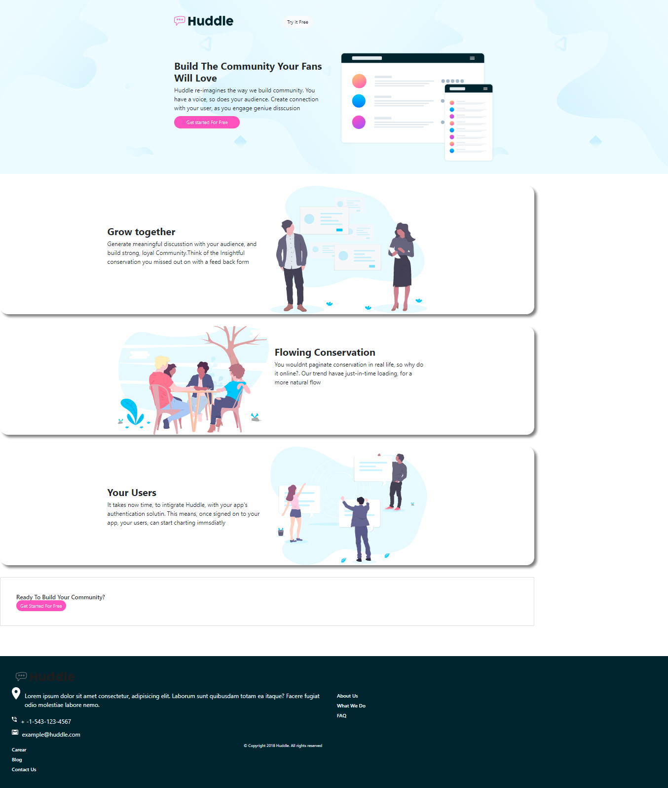

# Frontend Mentor - Huddle landing page with alternating feature blocks solution

## the challenge was gotten from Frontend Mentor, and it was done, using HTML CSS and BOOSTRAP. We created an optimal layout for the user, depending on the devices beeing used.

## My process

### Built with

- Semantic HTML5 markup
- CSS custom properties
- Flexbox
- CSS Grid
- Mobile-first workflow
- CSS Frae Work (Boostrap)

### Continued developmetn

  #### I want to continune working on my CSS Frame working, getting better 
